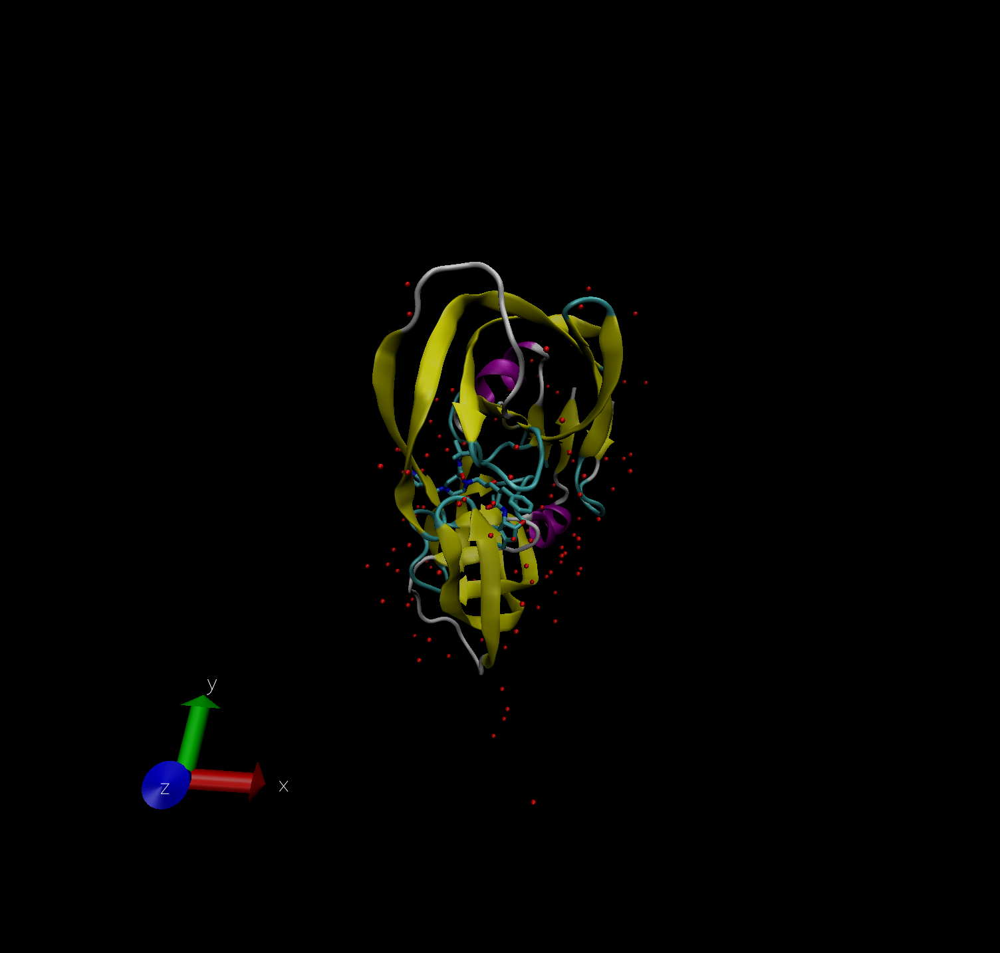
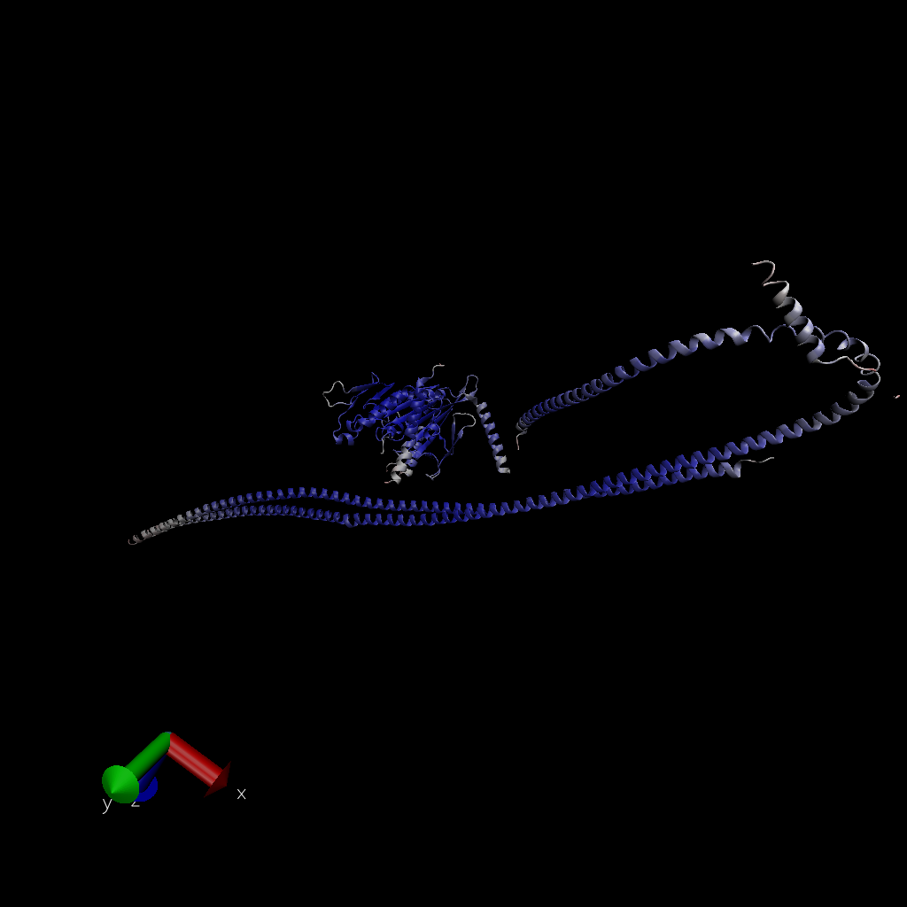

# The PDB database

The PDB is the main repository for 3D structure data of biomolecules.

Here we explore its composition.

> Q1. What percentage of structures in the PDB are solved by X-Ray and Electron Microscopy?

```{r}
#Downloaded CSV file
x <- read.csv("Data Export Summary.csv", row.names = 1)
x
```

```{r}
# Find percentage of structures solved by X-Ray and EM
column.sums <- colSums(x)
column.sums
round(column.sums/column.sums["Total"]*100, 3)
```

87.197%% of the structures in PDB are solved by X-Ray, and 5.354% by Electron Microscopy.

> Q2. What proportion of structures in the PDB are protein?

```{r}
column.sums["Total"]
proteins <- x["Protein (only)","Total"]
round((proteins/column.sums["Total"])*100, 3)
```

87.27% of the structures in the PDB are protein.

> Q3. Type HIV in the PDB website search box on the home page and determine how many HIV-1 protease structures are in the current PDB?

```{r}

```

Here is a VMD generated image of HIV-protease, PDB code: 1HSG



> Q4. Water molecules normally have 3 atoms. Why do we see just one atom per water molecule in this structure?

We see just one atom per water molecule because this atom is oxygen, and the VMD program does not have a high enough resolution to view hydrogen, which is very small.

> Q5. There is a conserved water molecule in the binding site. Can you identify this water molecule? What residue number does this water molecule have (see note below)?

This water molecule is residue number 308.

## Bio3D package for structural bioinformatics

Load the Bio3D package.

```{r}
# Installed Bio3D package
library(bio3d)
pdb <- read.pdb("1HSG")
pdb
```

```{r}
head(pdb$atom)
```

Extract the sequence for ADK:

```{r}
library(ggplot2)
library(ggrepel)
library(devtools)
library(BiocManager)
aa <- get.seq("1ake_A")
aa
```

```{r}
blast <- blast.pdb(aa)
```

```{r}
hits <- plot(blast)
hits$pdb.id
```

## Normal mode analysis (NMA)

```{r}
pdb <- read.pdb("1ake")
pdb
```

Trim to chain A only.

```{r}
chain <- trim.pdb(pdb, chain = "A")
chain
```

Run a bioinformatics method to predict the flexibility and "functional motions" of this protein chain.

```{r}
modes <- nma(chain)
mktrj.nma(modes, mode=7, file="mode_7.pdb")
```

Align and superimpose structures.

## AlphaFold rendering of Find a Gene Protein



