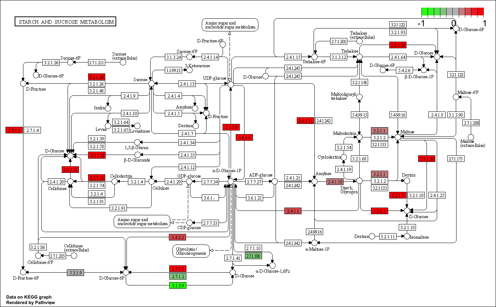
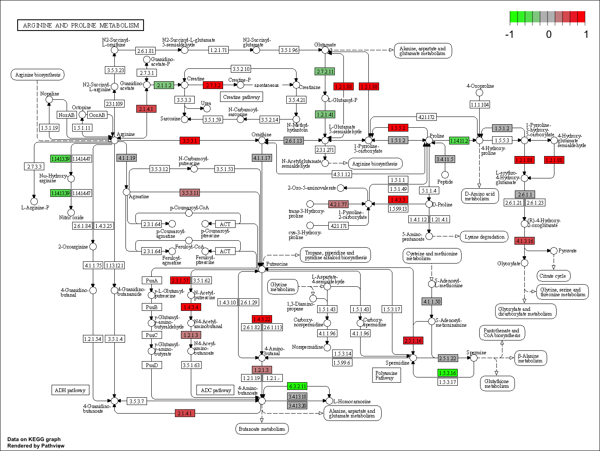

Install BioConductor

```{r}
# install.packages("BiocManager)
# BiocManager :: install()
# BiocManager :: install("DESeq2")
library(BiocManager)
library(DESeq2)
```

Upload the count data and meta files.

```{r}
counts <- read.csv("https://bioboot.github.io/bimm143_W18/class-material/airway_scaledcounts.csv", row.names=1)
metadata <-  read.csv("https://bioboot.github.io/bimm143_W18/class-material/airway_metadata.csv")
head(counts)
head(metadata)
```

```{r}
control <- metadata[metadata[,"dex"]=="control",]
control.counts <- counts[ ,control$id]
control.mean <- rowSums( control.counts )/4 
head(control.mean)
```

> Q1. How many genes are in this dataset?

There are 38694 genes in the dataset.

> Q2. How many ‘control’ cell lines do we have?

There are 4 control cell lines.

> Q3. How would you make the above code in either approach more robust?

You can make the above code more robust by using summary() instead of just finding the mean.

> Q4. Follow the same procedure for the treated samples (i.e. calculate the mean per gene across drug treated samples and assign to a labeled vector called treated.mean)

```{r}
treated <- metadata[metadata[,"dex"]=="treated",]
treated.counts <- counts[ ,treated$id]
treated.mean <- rowSums( treated.counts )/4 
head(treated.mean)
```

> Q5. Create a scatter plot showing the mean of the treated samples against the mean of the control samples. 

```{r}
meancounts <- data.frame(control.mean, treated.mean)
head(meancounts)
```

```{r}
plot(meancounts[,1],meancounts[,2], xlab="Control", ylab="Treated")
```

```{r}
plot(meancounts[,1],meancounts[,2], log = "xy", xlab="Control", ylab="Treated")
```

```{r}
meancounts$log2fc <- log2(meancounts[,"treated.mean"]/meancounts[,"control.mean"])
head(meancounts)
```

> Q5b. You could also use the ggplot2 package to make this figure producing the plot below. What geom_?() function would you use for this plot?

You would use geom_point() to use ggplot.

> Q6. Try plotting both axes on a log scale. What is the argument to plot() that allows you to do this?

You would use log() to plot the axes on a log scale.

```{r}
zero.vals <- which(meancounts[,1:2]==0, arr.ind=TRUE)
to.rm <- unique(zero.vals[,1])
mycounts <- meancounts[-to.rm,]
head(mycounts)
```

> Q7. What is the purpose of the arr.ind argument in the which() function call above? Why would we then take the first column of the output and need to call the unique() function?

The purpose of the arr.ind argument is which array indices should be returned when x is an array.

> Q8. Using the up.ind vector above can you determine how many up regulated genes we have at the greater than 2 fc level?

> Q9. Using the down.ind vector above can you determine how many down regulated genes we have at the greater than 2 fc level?

```{r}
up.ind <- mycounts$log2fc > 2
down.ind <- mycounts$log2fc < (-2)
count(up.ind)
count(down.ind)
```

There are 250 up regulated genes at a greater than 2 fc, and 367 down regulated genes at a greater than 2 fc level.

> Q10. Do you trust these results?

```{r}
library(DESeq2)
citation("DESeq2")
dds <- DESeqDataSetFromMatrix(countData=counts, 
                              colData=metadata, 
                              design=~dex)
dds <- DESeq(dds)
res <- results(dds)
summary(res)
res05 <- results(dds, alpha=0.05)
summary(res05)
```

Based on the summary of the results, I do trust these results and DESeq analysis.

## Adding annotation data

To help interpret our results we need to understand what the differentially expressed genes are. The first step is to get the gene names (ie. gene SYMBOLs).

```{r}
# BiocManager::install("AnnotationDbi")
# BiocManager::install("org.Hs.eg.db")
library(AnnotationDbi)
library(org.Hs.eg.db)
columns(org.Hs.eg.db)
```

```{r}
res$symbol <- mapIds(org.Hs.eg.db, keys = row.names(res), keytype = "ENSEMBL", column = "SYMBOL", multiVals = "first")
head(res)
```

> Q11. Run the mapIds() function two more times to add the Entrez ID and UniProt accession and GENENAME as new columns called res$entrez, res$uniprot and res$genename.

```{r}
res$entrez <- mapIds(org.Hs.eg.db, keys = row.names(res), keytype = "ENSEMBL", column = "ENTREZID", multiVals = "first")
head(res)
```

```{r}
res$uniprot <- mapIds(org.Hs.eg.db, keys = row.names(res), keytype = "ENSEMBL", column = "UNIPROT", multiVals = "first")
head(res)
```

```{r}
res$genename <- mapIds(org.Hs.eg.db, keys = row.names(res), keytype = "ENSEMBL", column = "GENENAME", multiVals = "first")
head(res)
```

## Pathway Analysis

Install and load packages, then look at the first two pathways in KEGG.

```{r}
# BiocManager::install( c("pathview", "gage", "gageData") )
library(pathview)
library(gage)
library(gageData)
data(kegg.sets.hs)
head(kegg.sets.hs, 2)
```

Need a vector of fold-change labeled with the names of genes in ENTREZ format.

```{r}
foldchanges <- res$log2FoldChange
names(foldchanges) <- res$entrez
head(foldchanges)
```

Now we can run the GAGE analysis in the foldchange vector and the KEGG datasets we are interested in.
 
```{r}
keggres <- gage(foldchanges, gsets = kegg.sets.hs)
attributes(keggres)
head(keggres$less, 3)
```

Now I can map the foldchange results onto a KEGG pathway. Do this manually by selecting a pathway ID from above.

```{r}
pathview(gene.data = foldchanges, pathway.id = "hsa05310")
# Save results
write.csv(res, file = "deseqresults.csv")
```


Use a different output of the same data.

```{r}
pathview(gene.data=foldchanges, pathway.id="hsa05310", kegg.native=FALSE)
```

> Q12. Can you do the same procedure as above to plot the pathview figures for the top 2 down-regulated pathways?

```{r}
head(keggres$greater, 2)
pathview(gene.data = foldchanges, pathway.id = "hsa00500")
pathview(gene.data = foldchanges, pathway.id = "hsa00330")
```



